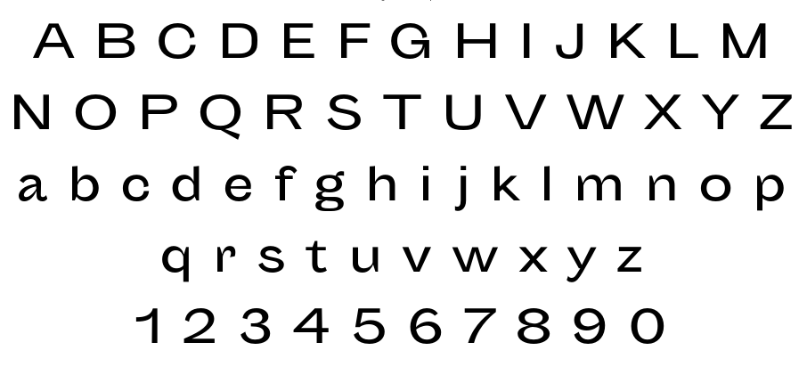

# Sporting Grotesque

A fork by [schoener](http://wirsindschoener.de/) of a grotesque typeface by [Lucas Le Bihan](http://lucaslebihan.fr/)
The changes are in the capitals like A, M, Z, V, N, which become sharper.



## Présentation

```
C’est une équipe de ligue 1.

Son hymne :
(librement inspiré d’une composition de Pierre Bachelet)

La victoire au bout du pied
Le ballon au fond des filets
L’ennemi désemparé
Nous vaincrons, nous serons les premiers
Allez Sporting Sporting Grotesque,
But ! But ! But !
```

## Features

```
En plus d’un jeu de caractère comprenant
Petites capitales et chiffres suspendus,
le Sporting Grotesque offre des options de titrage
opentype disponibles dans l’option « Titling Alternates ».

Merci,
Lucas Le Bihan
```

## Licence

SIL Open Font License v1.1
